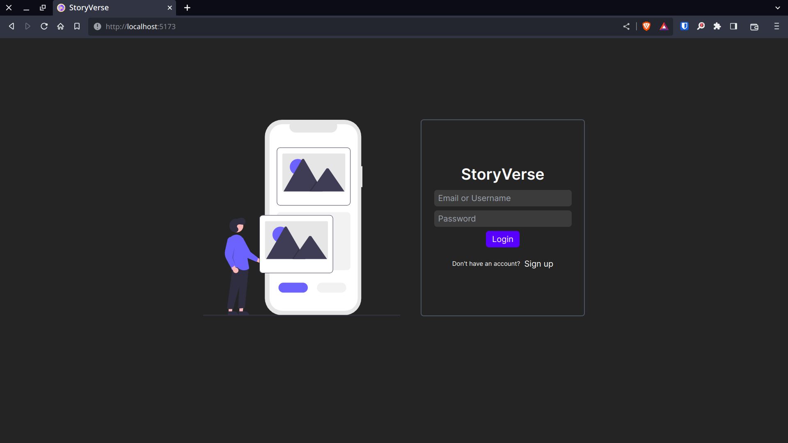
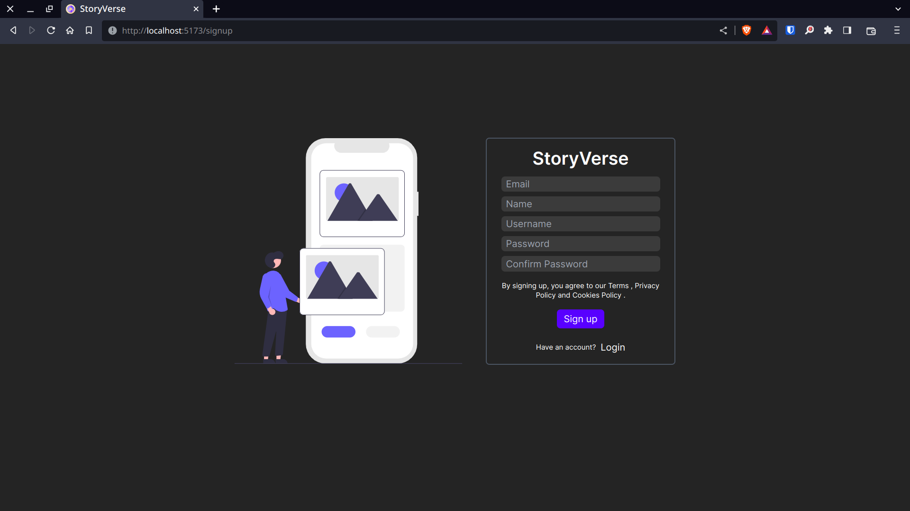

# StoryVerse

## A Full Stack Social Media Application




## Built with

1. React
2. Vite
3. Tailwind
4. NodeJs
5. Express
6. MongoDB
7. Nodemailer
8. Cloudinary

# Installation
### Project Installation Guide

Follow these steps to set up and run your project locally:

### 1. Environment Configuration
Inside the `server` folder, create a `.env` file. Copy the contents from `.env.example` and fill in the required values.
```bash
cd server
cp .env.example .env
# Open .env file and fill in the required values
```

### 2. Docker Compose
Run the following command in the project root directory to start the backend Node.js server and MongoDB database using Docker Compose.
```bash
docker-compose up
```
This command will read the `docker-compose.yml` file and set up the necessary containers for your project.

### 3. Client Setup
Navigate to the `client` directory and install the project dependencies using npm.
```bash
cd client
npm install
```
### 4. Run the Client
Once the dependencies are installed, run the following command to start the Next.js project.
```bash
npm run dev
```
This will launch the development server, and you can access your project by visiting `http://localhost:5173` in your web browser.
Now, your project should be up and running locally. Make sure to check the documentation for any additional configuration or steps specific to your project.

## Screenshots


## Our Contributors

<a href="https://github.com/rwiteshbera/StoryVerse/graphs/contributors">
  
</a>
